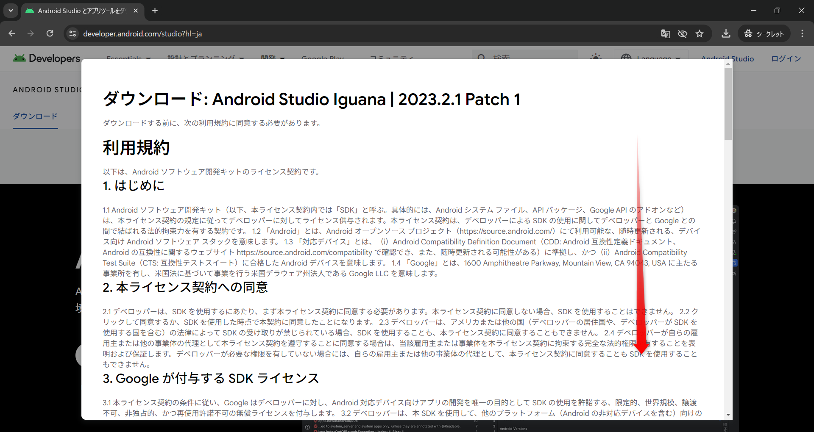
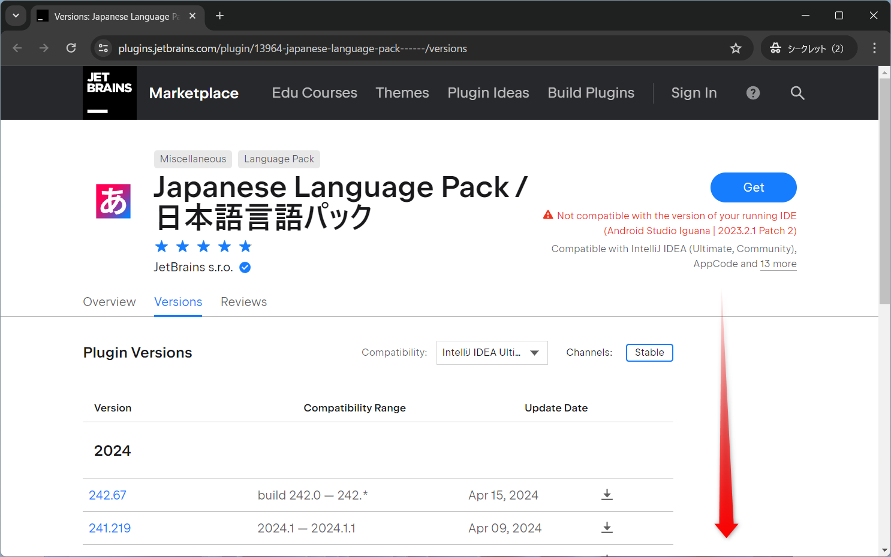

# Android Studio

## インストールの手順

### ダウンロード

下記サイトからAndroid Studioをダウンロードする  
https://developer.android.com/studio?hl=ja

`上記の利用規約～同意します。`にチェックを入れて`ダウンロード Android Studio～`をクリック

`ダウンロード`フォルダに保存する  

### インストール

ダウンロードしたファイルを実行  

`Next`をクリック  

`Next`をクリック  

`Next`をクリック  

`Install`をクリック  

インストールが始まるの待つ  

インストールができたら`Next`をクリック  

`Finish`をクリック  

## 初期設定

`Do not import settings`のまま`OK`をクリック  

`Help improve Android Studio`は`Don't send`をクリック  

`Next`をクリック  

`Next`をクリック  

`Next`をクリック  

`Accept`にチェックを入れて`Finish`をクリック  

必要なファイルのダウンロードが始まるの待つ  

ダウンロードが終わったら`Finish`をクリック  

## 新しいプロジェクトの作成

`New Project`をクリック  

今回は参考までに`Bottom Navigation Views Activity`をクリックして`Next`をクリック  

下記設定に変更して`Finish`をクリック
- Language : Java
- Build configuration language : Groovy DSL (build.gradle)

Android Studioで新規プロジェクトが起動する  

## Android端末のエミュレーター設定

パソコン上でAndroidスマホを仮想的に動かすエミュレーターを作る

`Device Manager`アイコンをクリック  

`Create virtual device`をクリック  

今回は参考までに`Pixel 8 Pro`で作る  
`Pixel 8 Pro`をクリックして`Next`をクリック  

今回は参考までに`Pixel 8 Pro`にAndroid OS Ver11.0を乗せる  
`R`の右のダウンロードボタンをクリックする  

ダウンロードが始まるの待つ  

ダウンロードが終わったら`Finish`をクリック  

`Next`をクリック  

`Finish`をクリック  

`Device Manager`に今回作った`Pixel 8 Pro`が表示される  
表示が確認できたら上の緑の再生ボタンをクリック

しばらくすると`Pixel 8 Pro`のエミュレーターが起動する  

## Android Studioの日本語化

### Android Studioのバージョンを確認する  

メニューバーから`Help`→`About`  

`Build`の記載を確認する  
今回は`#AI-232.10300`  

### 日本語化ファイルをダウンロード  

下記サイトからAndroid Studioの日本語化ファイルをダウンロードする  
https://plugins.jetbrains.com/plugin/13964-japanese-language-pack------/versions/stable

確認したバージョンに近いバージョンを探す  
下へスクロール  

`Show More`をクリックして、過去のバージョンも表示する  

今回は`232.105`が近いので、これをダウンロードする  
ダウンロードボタンをクリック  

`Download`をクリックしてダウンロードする  

`ダウンロード`フォルダに保存する

### 日本語化ファイルを所定の位置に移動  

ダウンロードしたファイルを解凍(展開)する  
`Shiftキーを押しながら右クリック`→`7-Zp`→`ここに展開`をクリック  

展開されたフォルダ(今回は`ja.232.105`フォルダ)を下記フォルダに移動する  
`C:\Program Files\Android\Android Studio\plugins`  

### 日本語化

これから日本語に設定する

Android Studioの右上の歯車アイコンをクリックして`Plugins`をクリック  

`Install Plugin from Disk...`をクリック  

先ほど移動した`ja.232.105`フォルダを探す  
そのフォルダの中の`lib\ja.232.105.jar`を選択して`OK`をクリック  
`C:\Program Files\Android\Android Studio\plugins\ja.232.105\lib\ja.232.105.jar`  

`OK`をクリック  

Android Studioを再起動するか確認されるので`Restart`をクリックして再起動  

Android Studioがある程度日本語化される  

